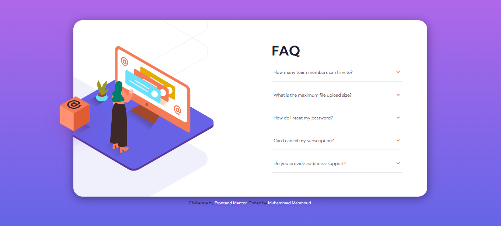
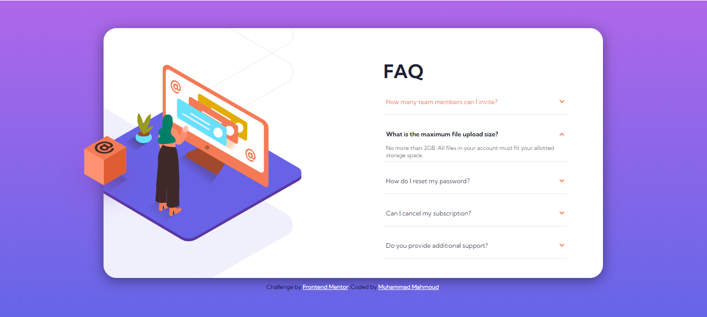
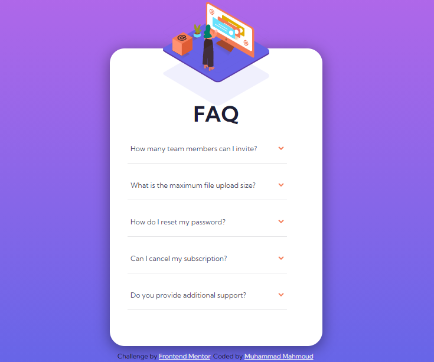

# Frontend Mentor - FAQ Accordion Card

This is a solution to the [[FAQ Aaccordion Challenge on Frontend Mentor]](https://www.frontendmentor.io/challenges/faq-accordion-card-XlyjD0Oam).
Frontend Mentor challenges help you improve your coding skills by building realistic projects.

## Table of contents

-   [Overview](#overview)
    -   [The challenge](#the-challenge)
    -   [Screenshot](#screenshot)
    -   [Links](#links)
-   [My process](#my-process)
    -   [Built with](#built-with)
-   [Author](#author)

## Overview

### The challenge

Users should be able to:

-   View the optimal layout depending on their device's screen size
-   See hover states for interactive elements

### Screenshots

Desktop

Active State

Mobile

### Links

-   [Solution URL](https://github.com/MuhammadM1998/FrontendMentor-FAQ-Accordion-Card)
-   [Live Site URL](https://muhammadm1998.github.io/FrontendMentor-FAQ-Accordion-Card/)

## My process

### Built with

-   HTML5
-   CSS3
-   CSS Flexbox
-   Desktop-First Design

## Author

-   GitHub - [Muhammad Mahmoud](https://github.com/MuhammadM1998)
-   Frontend Mentor - [@MuhammadM1998](https://www.frontendmentor.io/profile/MuhammadM1998)
-   Twitter - [@MuhammadM1998](https://www.twitter.com/MuhammadM1998)
